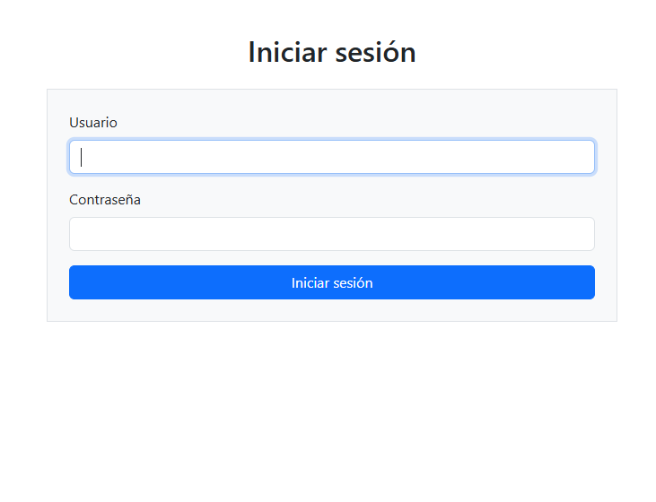
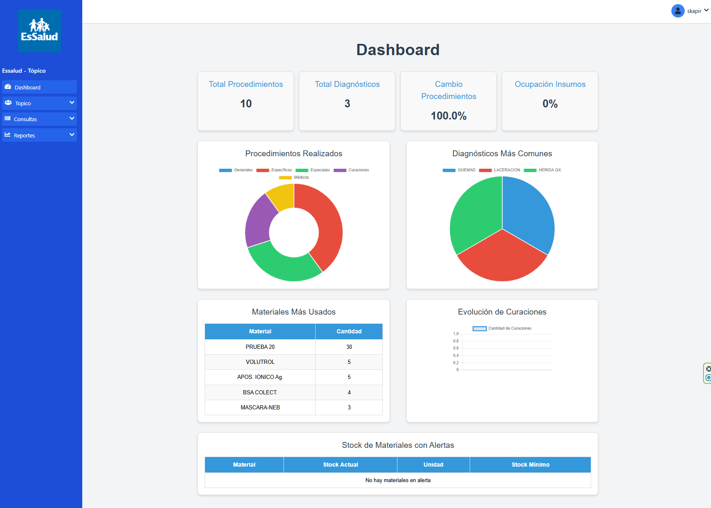
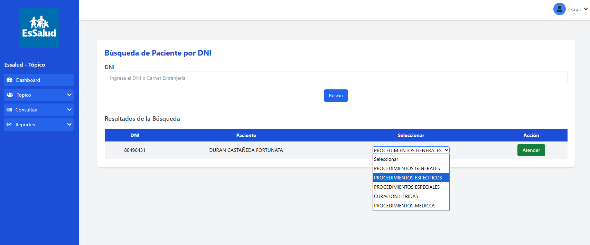
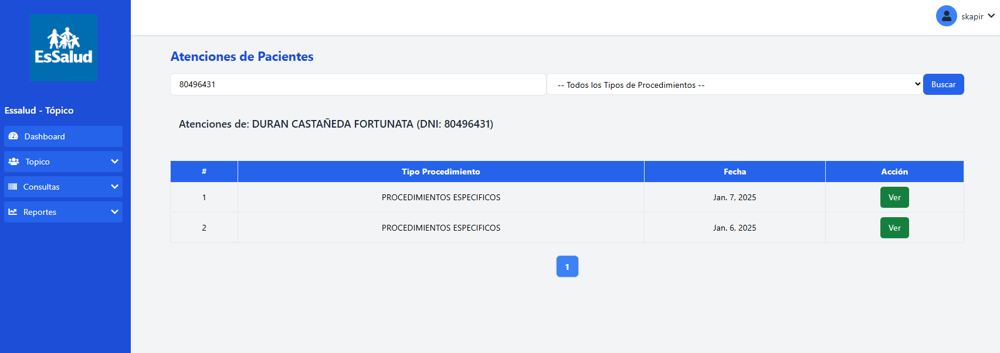
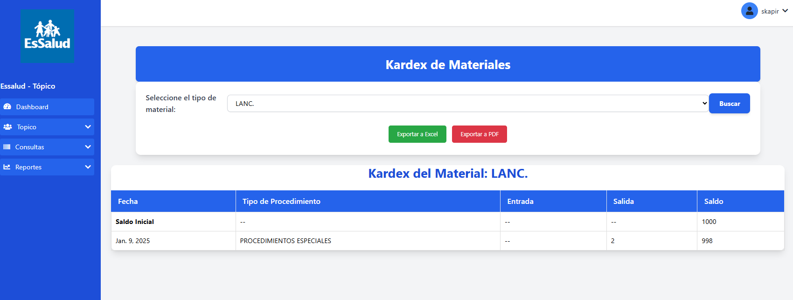
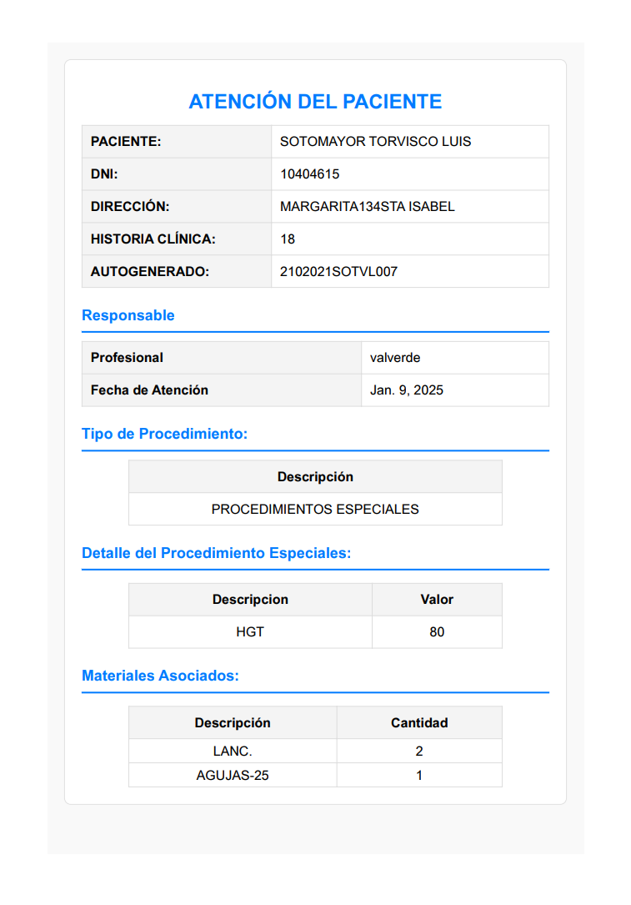

# 🏥 Sistema Tópico – CAP III EsSalud

Sistema web para la gestión de pacientes, atenciones y procedimientos en el área de Tópico.  
Proyecto desarrollado como parte de la **Tesis de Suficiencia Profesional**.

---

## 🎯 Problema que resuelve
En el área de Tópico, los registros de atención y procedimientos se realizaban de forma manual, generando retrasos, errores en la información y dificultad para obtener reportes confiables.

Este sistema digitaliza y optimiza el flujo de atención, permitiendo un registro rápido, consultas centralizadas, control de insumos y generación de reportes para la toma de decisiones.

---

## ✨ Características principales
- Registro digital de pacientes y procedimientos.
- Búsqueda de pacientes por DNI (RENIEC / EsSalud).
- Gestión de atenciones y tipos de procedimientos.
- Dashboard con métricas y estadísticas.
- Control de materiales e insumos (Kardex).
- Reportes y exportación a Excel y PDF.
- Optimización del flujo de trabajo del personal de enfermería.

---

## 🧠 Mi rol en el proyecto
- Análisis del proceso real del área de Tópico.
- Diseño de la arquitectura del sistema.
- Desarrollo backend y frontend del sistema.
- Modelado de base de datos y lógica de negocio.
- Implementación de reportes, dashboard y control de insumos.
- Enfoque en optimización de procesos y reducción de errores.

---

## 🛠️ Tecnologías usadas


---
## 🖼️ Capturas del sistema
> *Las imágenes corresponden al entorno de desarrollo.*
<p align="center">
  
  
</p>

<p align="center">
  
  
</p>
<p align="center">
 
  
</p>
<p align="center">
    
</p>

---

## 📈 Impacto del sistema
- Reducción de errores en el registro de atenciones.
- Mejora en los tiempos de atención al paciente.
- Centralización de información clínica y administrativa.
- Control eficiente del stock de materiales.
- Base preparada para futuras integraciones (HL7).

---
## 🚀 Instalación y uso

1. Clonar el repositorio:

   ```bash
   git clone https://github.com/Skapir/sistema-topico.git
   cd sistema-topico
   ```

2. Crear entorno virtual e instalar dependencias:

   ```bash
   python -m venv venv
   source venv/Scripts/activate   # en Windows
   pip install -r requirements.txt
   ```

3. Migrar base de datos:

   ```bash
   python manage.py migrate
   ```

4. Crear superusuario:

   ```bash
   python manage.py createsuperuser
   ```

5. Ejecutar el servidor:
   ```bash
   python manage.py runserver
   ```

---

## 📌 Estado del proyecto

Actualmente en desarrollo como parte de la **tesis profesional**.  
Se continuará optimizando con integración HL7 y automatización de flujos.

---

## 👨‍💻 Autor

**Sergio Pérez (Skapir)**  
📧 sperezn.dev@gmail.com
